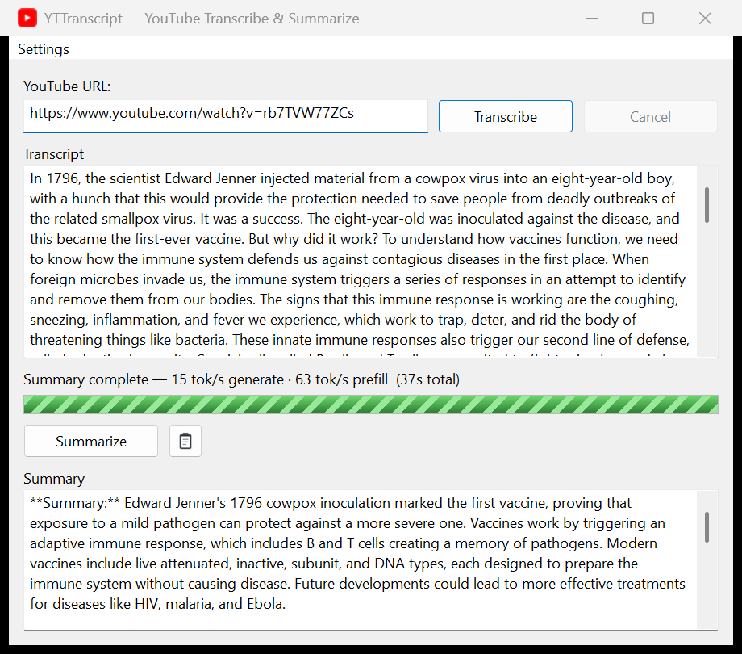

# YTTranscript

A single-file native **Windows desktop app** (`YTTranscript.exe`) that
**transcribes** a YouTube video and **summarizes** it — fully offline after
first run. CPU works out of the box; optional **Vulkan / CUDA** GPU
acceleration is a click away in Settings. Written in **pure C11 / Win32** and
cross-compiled from **WSL** with **mingw-w64**.


Paste a URL, click **Transcribe** (yt-dlp -> ffmpeg -> whisper.cpp), then
click **Summarize** (a bundled Qwen2.5-3B instruct model via llama.cpp,
map-reduced so arbitrarily long transcripts fit the context window), then
**Copy** the summary to the clipboard.

<p align="center">
  
</p>

> **Install (end users):** download `YTTranscript-Setup-x.y.z.exe` from the
> [Releases](https://github.com/swaub/YTTranscript/releases) page, run it, choose
> a **writable** folder (the per-user default is fine; avoid `Program Files`),
> and launch. The first run downloads the components it needs; after that it
> starts instantly.

---

## Features

- Clean, DPI-aware Win32 GUI (comctl32 v6 visual styles, Per-Monitor V2).
- URL box, **Transcribe** button, read-only scrolling transcript box, a
  status line + progress bar, **Summarize** button, summary box, and a
  **Copy** button with a small clipboard icon.
- All heavy work runs on **background worker threads** — the UI never
  freezes. Workers report back to the UI thread exclusively via
  `PostMessageW(WM_APP_*)`.
- **First-run bootstrap**: on first launch the app downloads the helper
  binaries and models it is missing into local `bin\` and `models\`
  folders, with a live byte-level progress bar. Files already present are
  skipped, so the download is resumable across launches.
- **Local, offline summarization** with hierarchical map-reduce, so videos
  far longer than the model context still summarize correctly.
- **CPU / Vulkan / CUDA, your choice.** A **Settings ▸ Encoder** menu detects
  your CPU, iGPU and GPU and lets you pick the engine per task, downloading the
  matching backend on demand; a live **words/sec & tok/s** readout makes the
  difference visible.
- **Security-first** subprocess handling: the URL is validated, never
  passed to a shell, and always handed to `yt-dlp` as its own argv element
  after `--`.

---

## Prerequisites

### Build host (WSL / Linux)

```sh
sudo apt-get update
sudo apt-get install -y gcc-mingw-w64-x86-64 binutils-mingw-w64-x86-64 make
```

### Run host (the end user)

- Windows 10 (1803+) or Windows 11, 64-bit.
- CPU-only is fine; 16 GB RAM recommended for the 3B summarizer.
- An internet connection on first run (to fetch the helper tools + models).
- `tar.exe` (OS-bundled bsdtar) is present on Win10 1803+ / Win11 and is
  used to unzip the helper bundles — no extra software needed.

---

## Building

From the project root, either:

```sh
./build.sh
```

or:

```sh
make
```

Both produce **`dist/YTTranscript.exe`**, a statically linked executable
(`-static` bundles libgcc/winpthread, so there are no extra runtime DLLs
to ship). `-municode` makes `wWinMain` the entry point and `-mwindows`
selects the GUI subsystem (no console window).

The resource script `res/app.rc` is compiled with `windres -I res` so that
the bare resource names (`icon.ico`, `clipboard.ico`, `app.manifest`)
resolve relative to the `res/` directory.

### Icons

Two `.ico` files are referenced by `res/app.rc` and must exist before the
resource compiles:

- `res/icon.ico` — the app/window/taskbar icon: a YouTube-style red
  rounded square with a white play triangle, multi-size (16/32/48/256).
- `res/clipboard.ico` — a 16x16 clipboard glyph used on the **Copy**
  button.

These binaries are generated separately. If you need to (re)generate them,
any icon authoring tool or ImageMagick works, e.g.:

```sh
# example only -- supply your own artwork
magick icon-256.png -define icon:auto-resize=256,48,32,16 res/icon.ico
magick clip-16.png  res/clipboard.ico
```

---

## Project layout

```
.
├── src/
│   ├── common.h       shared contract (macros, ids, types, prototypes)
│   ├── main.c         wWinMain, DPI setup, window class, message loop
│   ├── ui.c           WndProc + all UI-thread logic / layout
│   ├── util.c         path resolution, URL validation, UTF-8 <-> UTF-16, files
│   ├── proc.c         safe argv quoting + redirected-pipe subprocess runner
│   ├── pipeline.c     transcribe worker (yt-dlp -> ffmpeg -> whisper)
│   ├── strutil.c      transcript cleanup + chunking
│   ├── summarize.c    summarize worker (map-reduce llama-completion)
│   ├── download.c     WinHTTP byte-progress downloader
│   ├── bootstrap.c    first-run download/extract orchestration
│   ├── clipboard.c    CF_UNICODETEXT clipboard copy
│   ├── hwdetect.c     DXGI GPU/iGPU detection (CPU / Vulkan / CUDA)
│   ├── settings.c     Encoder settings + engine routing
│   └── progressbar.c  custom animated progress-bar control
├── res/
│   ├── app.rc         resource script (icons, manifest, version info)
│   ├── app.manifest   comctl32 v6 + PerMonitorV2 + UTF-8 + supportedOS
│   ├── icon.ico       app icon (generated separately)
│   └── clipboard.ico  Copy-button glyph (generated separately)
├── installer/         Inno Setup script for the Windows installer
├── build.sh           WSL cross-build script
├── Makefile           make equivalent of build.sh
├── LICENSE            MIT (this project's source)
├── THIRD_PARTY_NOTICES.md
└── README.md
```

At runtime, **next to the .exe** (all paths derived from
`GetModuleFileNameW`, never the working directory):

```
YTTranscript.exe
bin\
  yt-dlp.exe
  ffmpeg.exe
  whisper\   whisper-cli.exe + its own ggml*.dll / whisper.dll
  llama\     llama-completion.exe + its own ggml*.dll / llama.dll
models\
  ggml-base.en.bin
  qwen2.5-3b-instruct-q4_k_m.gguf
temp\        scratch audio/wav + _prompt.txt
output\      <video-id>.txt transcripts
```

> The whisper and llama Windows bundles each ship **different versions** of
> `ggml.dll` / `ggml-base.dll` / `ggml-cpu.dll`. They are deliberately kept
> in **separate** `bin\whisper\` and `bin\llama\` folders, and each tool is
> launched with its working directory set to its own folder so its
> co-located DLLs resolve. Do not flatten them into one folder.

---

## First-run bootstrap

On launch the app checks for the six required assets and downloads only the
missing ones (in this order), showing real byte-level progress:

| # | Asset | Source | Approx size |
|---|-------|--------|-------------|
| 1 | `yt-dlp.exe` | github.com/yt-dlp/yt-dlp (latest) | ~18 MB |
| 2 | `ffmpeg.exe` | github.com/BtbN/FFmpeg-Builds (latest, static GPL win64 zip) | ~90 MB zip |
| 3 | `whisper-cli.exe` + DLLs | whisper.cpp v1.9.1 `whisper-bin-x64.zip` | ~12 MB zip |
| 4 | `ggml-base.en.bin` | huggingface.co/ggerganov/whisper.cpp | ~142 MB |
| 5 | `llama-completion.exe` + DLLs | llama.cpp `b9811` win-cpu-x64 zip | ~30 MB zip |
| 6 | `qwen2.5-3b-instruct-q4_k_m.gguf` | huggingface.co/Qwen/Qwen2.5-3B-Instruct-GGUF | ~1.93 GB |

Mechanics (see `src/download.c` and `src/bootstrap.c`):

- Downloads use **WinHTTP** with automatic-proxy detection and default
  redirect following (GitHub -> objects.githubusercontent.com, Hugging
  Face -> CDN are 302s that are followed automatically — redirects are
  **not** disabled). Each file streams to a `*.part` temp and is renamed on
  success, so an interrupted first run never leaves a half file that would
  pass the presence check.
- The three `.zip` bundles are unpacked with the OS-bundled **`tar.exe`**
  (bsdtar) into `bin\`, `bin\whisper\`, and `bin\llama\` respectively. Two
  bundles nest their payload in a subfolder, which the bootstrap flattens:
  the BtbN ffmpeg zip nests `ffmpeg-*\bin\ffmpeg.exe` (lifted to
  `bin\ffmpeg.exe`), and `whisper-bin-x64.zip` nests everything under
  `Release\` (lifted up to `bin\whisper\` so `whisper-cli.exe` sits beside
  its `ggml*.dll`). The llama zip is already flat.
- The **Transcribe** and **Summarize** buttons stay disabled until all six
  assets are confirmed present.

### Version- and integrity-aware detection

Subsequent launches do **not** re-download anything that is already present
and current — they start instantly and offline. Detection is recorded in a
small `installed.cfg` file next to the `.exe` (`key=version` per line):

- Each component has a pinned version + an integrity size floor baked into
  the build. On launch an asset is **skipped** when its file is present,
  passes the size floor, and its recorded version matches the pinned one.
- A present file with **no** record yet (e.g. the first launch after this
  feature shipped) is **adopted** into `installed.cfg` — recorded, not
  re-downloaded. (For yt-dlp the real installed version is read via
  `yt-dlp --version` so it's adopted with its true tag.)
- An asset is re-downloaded **only** when its file is missing, smaller than
  the integrity floor (corrupt/truncated), or the build's pinned version was
  bumped above the recorded one — and only that one asset.
- **yt-dlp** additionally gets a **throttled, best-effort online freshness
  check** (at most once per local day) against
  `api.github.com/repos/yt-dlp/yt-dlp/releases/latest`, because yt-dlp is the
  one tool that breaks when YouTube changes. If it's behind, only yt-dlp
  (~18 MB) is refreshed. Offline or any error → the installed yt-dlp is kept.
- llama.cpp build tags rotate and old ones get pruned; if the pinned llama
  zip ever 404s, the bootstrap queries llama.cpp's latest release tag and
  rebuilds the download URL from it.

> **Note for whoever builds this:** the downloaded helpers/models live in
> `bin\` and `models\` next to the `.exe` (so under `dist\` for a `dist\`
> build). `build.sh`/`make` only write the `.exe` + `app.res` and never
> touch that data — but do **not** `rm -rf dist`, or you'll wipe ~2.3 GB of
> downloads and force a full re-fetch on next launch.

---

## Usage

1. Launch `YTTranscript.exe`. On first run, wait for the bootstrap
   download/extract to finish (progress shows in the status line + bar).
2. Paste a YouTube URL (`youtube.com/watch`, `youtu.be/...`,
   `youtube.com/shorts/...`, `/live/...`).
3. Click **Transcribe**. The audio is downloaded, converted to 16 kHz mono
   WAV, and transcribed; the punctuated text appears in the transcript box
   and is also written to `output\<video-id>.txt`.
4. Click **Summarize** for a local map-reduce summary (overview +
   bullets).
5. Click **Copy** to put the summary on the clipboard.
6. **Cancel** stops the running pipeline (it terminates the active child
   process and aborts between stages).

---

## How it works (subprocess command lines)

All external tools are launched via `CreateProcessW` with redirected
stdout/stderr pipes (no shell, `CREATE_NO_WINDOW`, hidden window). A short
reader thread drains stdout while the worker drains stderr line-by-line for
progress, so neither pipe can dead­lock.

```
yt-dlp  -f bestaudio/best --no-playlist --no-part --newline
        --ffmpeg-location "bin\ffmpeg.exe"
        -o "temp\%(id)s.%(ext)s" --print after_move:filepath -- "<URL>"

ffmpeg  -nostdin -hide_banner -y -loglevel error -i "<audio>"
        -ar 16000 -ac 1 -c:a pcm_s16le -f wav "temp\<id>.wav"

whisper bin\whisper\whisper-cli.exe -m "models\ggml-base.en.bin"
        -f "temp\<id>.wav" -l en -t <threads> -bs 5 -np -pp -otxt
        -of "output\<id>"

llama   bin\llama\llama-completion.exe -m "models\qwen2.5-3b-instruct-q4_k_m.gguf"
        -c <auto> -n 512 -t <threads> -ngl 0 --temp 0.3 --top-p 0.9
        -no-cnv --no-display-prompt --no-warmup -f "temp\_prompt.txt"
```

`-c` is auto-sized to the prompt (capped at the model's 32K training context).
Transcripts up to ~32K characters (≈ a 20–25 min video) are summarized in a
**single pass** — one model load — instead of the per-chunk map-reduce, which
is reserved for genuinely long videos. This is the big CPU-time saver.

The URL is validated as a plausible YouTube URL **before** any argv is
built (https only, no control chars/quotes/spaces, host restricted to
youtube.com / youtu.be / m.youtube.com), and is always passed as its own
argument after `--` — `cmd.exe`/`system()` are never used.

---

## Troubleshooting

- **"Setup failed while installing …"** — a download or extract step
  failed. Check your connection and relaunch; completed files are kept and
  skipped, so it resumes.
- **Corporate networks** may block or MITM the GitHub/Hugging Face CDNs.
  WinHTTP uses the system proxy via automatic detection; configure the
  Windows proxy if needed.
- **`tar.exe` not found** — you are on a pre-1803 Windows 10 build. Update
  Windows, or manually unzip the three bundles into `bin\`,
  `bin\whisper\`, and `bin\llama\`.
- **Transcription is slow** — whisper is CPU-only; `base.en` is the
  speed/quality compromise here. Thread count is auto-detected and clamped
  to a sane range.
- **Summarization is slow / uses lots of RAM** — the Qwen2.5-3B Q4_K_M
  model needs a few GB of RAM and runs on CPU (`-ngl 0`). Long videos go
  through multiple map-reduce passes.

---

## License

YTTranscript's own source code is licensed under the **[MIT License](LICENSE)**.

The third-party tools and models it **downloads at runtime** (yt-dlp, FFmpeg,
whisper.cpp, llama.cpp, and the Whisper and Qwen2.5 models) are **not** bundled
with this repository or the installer, and are each governed by their own
licenses — see **[THIRD_PARTY_NOTICES.md](THIRD_PARTY_NOTICES.md)**.

> ⚠️ The default summarizer, **Qwen2.5-3B-Instruct**, is licensed for
> **non-commercial use only**, and the downloaded FFmpeg build is **GPL**. Both
> are fetched at runtime, not redistributed here. For commercial use, swap in an
> Apache-2.0 summarization model.
